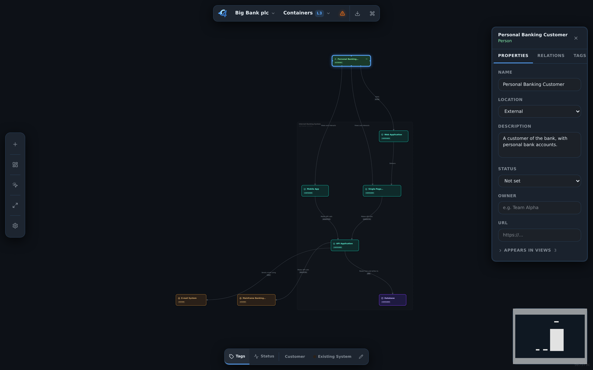

# c4hero

[](https://github.com/c4hero/c4hero/actions/workflows/ci.yml)
[](LICENSE)
[](https://github.com/c4hero/c4hero/releases)
[](#local-development)

> **Draw C4 diagrams. Own the files.** A visual canvas for the [C4 model](https://c4model.com) that saves to plain Structurizr DSL on your machine. Local-first, git-friendly, no account, Apache-2.0.

*I built c4hero because I wanted to design C4 diagrams in a real editor — drag, drop, connect — and still get Structurizr's portable plain-text format on disk.*

**Website: [c4hero.com](https://c4hero.com) · Open the app: [app.c4hero.com](https://app.c4hero.com) · [What's new in 0.5.0](CHANGELOG.md)**



---

## How it works

1. **Open a folder or a `.dsl` file.** Existing Structurizr DSL loads as-is, no conversion. Or start from a built-in sample (Big Bank, microservices, monolith, event-driven).
2. **Model on the canvas.** Add people, systems, containers, and components, wire relationships, drill between levels, let auto-layout do the tidying.
3. **Save.** What lands on disk is plain Structurizr DSL, ready to commit and review like any other file:

```dsl
workspace "E-Commerce Platform" {
  model {
    customer = person "Customer"
    platform = softwareSystem "E-Commerce Platform" {
      apiGateway = container "API Gateway" "Routes + auth" "Node.js"
      orderService = container "Order Service" "Cart + checkout" "Go"
    }
    customer -> apiGateway "Browses"
    apiGateway -> orderService "Routes"
  }
  views { container platform "Containers" { include * } }
}
```

The canvas and the text are two views of the same model. Edit either one, in c4hero or in any other Structurizr tool, and the other follows. Layout is kept in a sidecar file so hand-placed positions survive text edits.

New to C4? Start with [c4model.com](https://c4model.com).

## What you get

- **The whole C4 view set.** System Landscape, System Context, Container, Component, plus Deployment views for where things run and Dynamic views for how a flow unfolds. Every view is a focused slice of one underlying model, with drill-through between levels. Code-level (L4) diagrams are out of scope.
- **Structurizr DSL, native.** Read and write the same DSL the official Structurizr tools use, verified against the real Structurizr parser in CI. A live code pane (`mod+e`) shows the workspace as DSL beside the canvas and edits flow both ways; text that doesn't parse never touches your model. Element IDs are readable `camelCase` derived from names, so the exported DSL reads like code.
- **Files you own.** Open a folder of `.dsl` files as a collection or a single file. Layout lives in a sidecar JSON next to each workspace, so positions survive text edits. Installable as a PWA and works offline. There is no c4hero server.
- **Know what breaks before you delete.** Ask what happens if an element goes away and get the exact blast radius: children removed with it, relationships that lose an endpoint, dependents a few hops out, and views that disappear. Counted from your model, never estimated.
- **Layout you control.** Dagre auto-arrange in any direction, snap-to-grid, smart edge routing, zoom-to-fit, minimap. Lock a single node or freeze a whole view's layout.
- **Find and highlight.** Search across views (`mod+f`), a highlighter that stacks tag, status, technology, and team filters, and a presentation mode for walkthroughs.
- **Share without friction.** Export PNG or SVG, copy straight to the clipboard, or export the whole workspace as one self-contained interactive HTML file — every view, browsable offline, no dependencies, deterministic so it diffs in review.
- **Keyboard-first.** `mod+k` opens a command palette with every action; undo, redo, duplicate, drill-in, add-element, and presentation mode all have shortcuts.
- **Themes.** Several built-in canvas themes (including the classic Structurizr palette, sepia, and slate), plus a Tag Manager to restyle any tag's colour, shape, and opacity across the model.
- **Optional AI, bring-your-own-key.** An opt-in assistant shows a model-health readout, walks you through guided cleanup, runs a deep architecture review, interviews you to fill in a view, and builds or edits the model from plain English. Every change previews first, preserves your layout, and is undoable. Bring an Anthropic, OpenAI, or Google Gemini key: it stays in your browser, requests go straight to the provider, and nothing runs until you turn it on.
- **Accessible.** Focus-trap dialogs, ARIA-labelled canvas, `prefers-reduced-motion` support.

The full catalogue lives in [`docs/FEATURES.md`](docs/FEATURES.md). How the code is put together is in [`ARCHITECTURE.md`](ARCHITECTURE.md).

## Browser support

c4hero runs in any modern browser. **Folder collections** rely on the [File System Access API](https://developer.mozilla.org/en-US/docs/Web/API/File_System_Access_API), which is currently only available in Chromium browsers (Chrome, Edge, Brave, Arc, Opera).

In Firefox and Safari you can still open and edit a single `.dsl` file at a time, export PNG / SVG / DSL / interactive HTML, and use every other feature. When folder workflows aren't supported, c4hero automatically falls back to the single-file flow.

## Local development

### Prerequisites

- Node.js 22+
- npm 10+
- Playwright browsers for E2E tests: `npx playwright install chromium`

### Run locally

```bash
npm install
npm run dev
```

The Vite dev server runs on `http://localhost:3004` with `strictPort: true`.

### Available commands

```bash
npm run dev               # dev server with HMR
npm run build             # production bundle in dist/
npm run preview           # serve the production bundle
npm run typecheck         # tsc -b
npm run lint              # eslint
npm test                  # unit tests with Vitest
npm run test:watch        # vitest in watch mode
npm run test:coverage     # vitest with coverage (what CI runs)
npm run test:conformance  # DSL round-trip checks against the Structurizr parser
npm run test:e2e          # playwright
npm run audit             # npm audit (production) with allowlist
npm run check             # lint + typecheck + unit tests + build
```

### Stack

React 19 + TypeScript (strict), Vite, Zustand + immer, React Flow (`@xyflow/react`), CodeMirror 6 for the DSL pane, a hand-written Structurizr DSL lexer/parser/serializer, Vitest + Playwright. Static deploy, no backend.

### Package distribution

c4hero is distributed as a source-available static app, not as an npm package. `package.json` is marked `private` to prevent accidental `npm publish` while still using npm for local development, CI, and builds.

## Deployment

Deployment guidance — Vercel pipeline, env-var expectations, security headers for self-hosting — is documented in [`docs/DEPLOYMENT.md`](docs/DEPLOYMENT.md).

## Privacy

c4hero is local-first. Workspaces stay on your device; nothing is uploaded to a c4hero server. AI provider keys are stored only in your browser and sent only to the provider you chose. The open source build has hosted observability off by default; `app.c4hero.com` may enable Cloudflare Web Analytics for aggregate usage counts and Sentry for scrubbed error reports. Full details in [`PRIVACY.md`](PRIVACY.md).

## Changelog

See [`CHANGELOG.md`](CHANGELOG.md) for notable changes. Releases are tagged in [GitHub Releases](https://github.com/c4hero/c4hero/releases).

## Maintenance

c4hero is maintained by one person in their spare time. I aim to respond to issues within a week. If something is broken, please include browser, OS, and a minimal `.dsl` snippet so I can reproduce — the bug template will prompt you. PRs that come with tests get reviewed first.

## Contributing

Contributions are welcome. Start with [`CONTRIBUTING.md`](CONTRIBUTING.md) for setup, workflow, and testing guidance, and please follow the [Code of Conduct](CODE_OF_CONDUCT.md).

To report a security issue, see [`SECURITY.md`](SECURITY.md).

## License

Released under the [Apache License 2.0](LICENSE).

The c4hero name, logo, domain, and product identity are not licensed under Apache-2.0. See [TRADEMARKS.md](TRADEMARKS.md) for the brand-use boundary.
