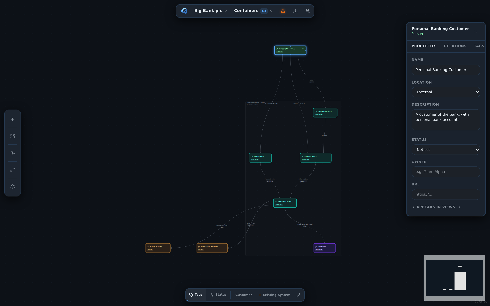

# c4hero for VS Code

Open a Structurizr `.dsl` file as the same visual c4hero canvas available at
[c4hero.com](https://c4hero.com), directly beside your code.



## Use

1. Install the `.vsix` using **Extensions: Install from VSIX**.
2. Open a `.dsl` file and run **c4hero: Open Architecture View**, or use its
   Explorer context action. **Reopen Editor With → Text Editor** shows the DSL.
3. Edit on the canvas. Model changes edit the real DSL document, so VS Code
   tracks unsaved changes and shows normal source control diffs.
4. Use **Ctrl/Cmd+S**, the canvas save button, or **c4hero: Save Architecture and
   Layout** to save the DSL, layout, and edited local include files together.
   VS Code Auto Save and Save All also save these dirty text documents.

Layout lives in `<name>.c4hero.json`. Moving boxes changes this separate document
and leaves the DSL byte for byte unchanged. The canvas save indicator includes
both files; the DSL tab's dirty dot only reflects DSL edits. The sidecar can be
opened as text, saved, compared, and recovered using VS Code's document tools.

Canvas undo/redo buttons and shortcuts use VS Code's native text history for the
changed document. A sidecar undo briefly activates its text editor before
returning to the canvas. Undo from VS Code's Edit menu acts on the active file.
External DSL, include, and sidecar edits refresh the canvas; invalid DSL shows an
error until corrected. Conflicting edits are rejected rather than overwriting a
newer document revision.

Use Explorer or the canvas **Open workspace** action to open another DSL file.
Local `!include`, `!docs`, and `!adrs` paths resolve relative to the opened DSL's
folder, including when no VS Code workspace folder is open. Paths escaping that
folder are rejected. Each DSL file has its own canvas and sidecar.

AI provider keys are optional and stored in VS Code SecretStorage. AI requests
are sent directly to the selected provider only when you use those features.
The extension includes no c4hero server, analytics, or Sentry reporting. Workspace
Trust is required. The interface follows the VS Code theme, including high contrast.

## Development

From the repository root:

```sh
npm ci
npm ci --prefix extension
npm run package:vscode
npm run test:vscode
```

The package is `extension/c4hero.vsix`. On headless Linux, use
`xvfb-run -a npm run test:vscode`. CI builds the VSIX, runs the browser checks and
native VS Code integration tests, and retains the installable artifact.

The extension uses URI-based `workspace.fs` access and runs in the workspace
extension host for remote providers. Automated tests cover Linux, an architecture
outside the workspace, and remote URI boundaries. Windows, macOS and a live
Remote-SSH session still require the manual release checks in `TESTING.md`.
